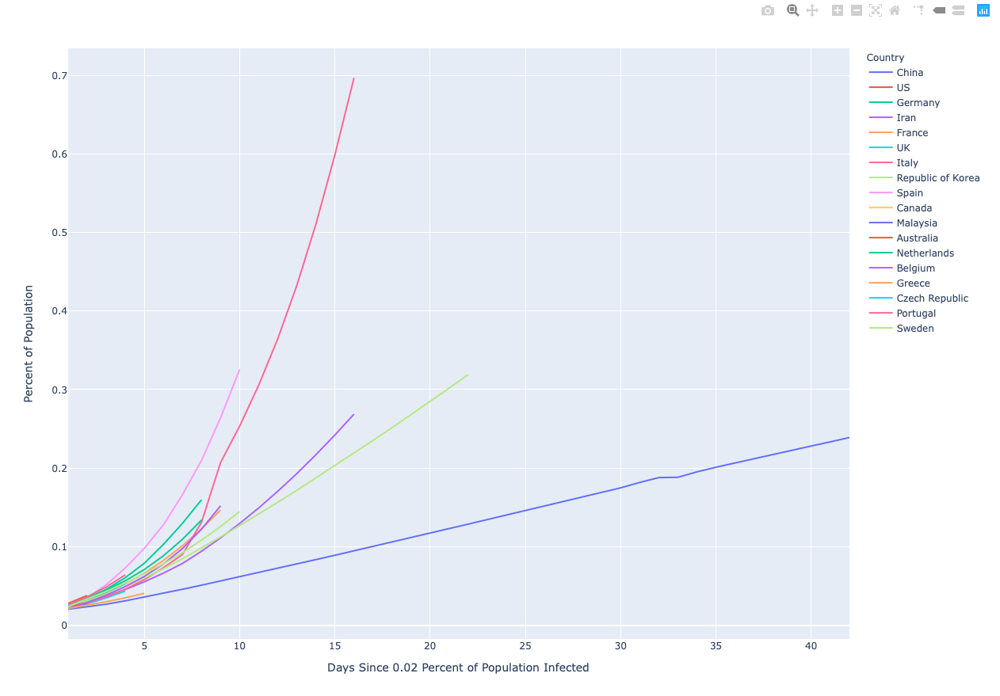

# COVID-19 Country Infection Rates

I've been frustrated with all the Coronavirus charts that try to compare countries' number of confirmed cases using absolute values, and wanted to see the values in some normalized terms - like percent of the country's population - so I made this script to do that.



> **Requires:** Python 3.6+, sqlite3, plotly

```
brew install python, sqlite3 \
    && pip3 install plotly \
    && git clone --recurse-submodules https://github.com/StevenEWright/coronavirus.git \
    && cd coronavirus \
    && python3 graph.py
```

This is just a throw-away project. The code is pretty how-ya-doin'. Don't expect updates or bug fixes if you happen to stumble upon this. If you use it for something, I'd love a mention, but, it's public domain.

The script is a Python routine which imports the [John's Hopkins' COVID-19 Dataset](https://github.com/CSSEGISandData/COVID-19)'s daily reports into a SQLite database along with 2018 world population data from [The World Bank Group](https://data.worldbank.org/indicator/SP.POP.TOTL) (with manual remapping of country names to the `COVID-19` dataset's names) and produces an interactive report.

I used SQLite because I thought it would be nice to be able to perform whatever queries I wanted if I was already going through the hassle of importing the data anyways.

The John Hopkins Dataset is surprisingly bad. Some countries have up to three different names. January's files contain a strange unicode character at the start of the first line. They changed their schemas but didn't provide new-schema versions of old files. I fell back to `csv` instead of using `pandas` because of this.

The John's Hopkins Dataset is a git submodule, so it should be easy to get new daily values by just updating the submodule commit.